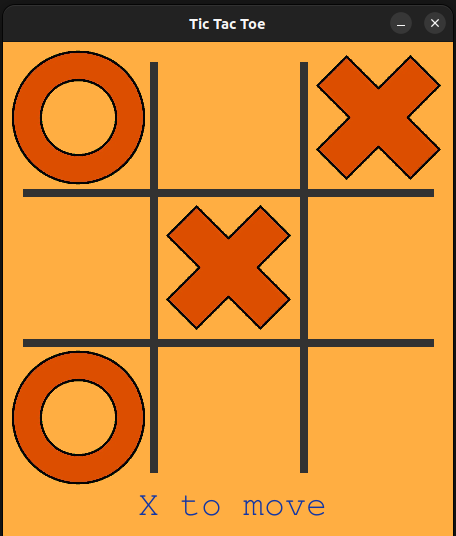

# Tic-tac-toe

# Summary 

This project is an implementation of Tic-Tac-Toe with a graphical interface built using the Pygame library. It draws inspiration from a tutorial available at [link](https://thepythoncode.com/article/make-a-tic-tac-toe-game-pygame-in-python).

One of the key highlights of this project is the implementation of an AI bot player. It uses the minimax strategy with alpha-beta pruning to make strategic moves. The bot is designed to play Tic-Tac-Toe perfectly and will never lose when playing optimally.

To give it a try, follow these steps:

1. Install the required dependencies by running pip install -r requirements.txt in the project repository.
2. Run the game by executing $ python3 game.py.

A graphical window will open, allowing you to play the game against the AI bot.

To see it working right away access the video on youtube: 

[YouYube](https://youtu.be/VHjF4BEk9LM)

# Repo Structure:

1. game.py: Responsible for implementing the game mechanics and user interface. This file likely contains the code for rendering the game board, handling player moves, checking for a winner, and displaying game status messages. It serves as the user-facing part of the Tic-Tac-Toe game.

2. robot_player.py: This file is responsible for implementing the bot's decision algorithm, specifically the minimax algorithm with alpha-beta pruning. It handles the logic for the bot's moves, determining the optimal move in response to the player's actions.

3. game_check.py: Responsible for checking the game's state, including whether it has ended, resulted in a tie, or if the bot has won or lost. This file likely contains functions to evaluate the game state, such as checking for winning patterns (e.g., vertical, horizontal, and diagonal) and determining if the game has reached a draw. It provides crucial information to both the game mechanics and the bot's decision algorithm to make informed decisions.

This clear separation of responsibilities makes the codebase organized and modular, which is a good practice in software development. It allows for easier maintenance and potential future enhancements. Additionally, it's a useful description for someone looking at the project's files to understand their roles and functions.

Future plans include turning the Pygame into a web application using a web server. We're exploring options like the open-source project 'pybag' for this transition. However, there are challenges due to Pybag's asynchronous nature that we need to address.

# Overview  TicTacToe

Class TicTacToe:

This class represents a simple Tic-Tac-Toe game implemented using the Pygame library. It provides a graphical interface for playing the game.

__init__(self, table_size): Initializes the game, setting up the game board, players, colors, and fonts.

main(self): The main game loop responsible for updating the Pygame display, processing user input events, and regulating the frame rate of the game.

draw_table(self): Draws the game board, dividing it into a 3x3 grid.

change_player(self): Switches the current player between "X" and "O" after each move.

move(self, pos): Handles player moves when a cell on the game board is clicked. It checks if the move is valid, updates the game board, checks for a winner, and handles the player change. Additionally, it allows the robot player to make a move using the minimax algorithm.

draw_char(self, x, y, player): Draws an "X" or "O" on the game board when a player makes a move.

message(self): Displays game instructions and messages, such as the current player's turn and the game outcome (win, draw, or in progress).

game_check(self): Checks for a winning pattern (vertical, horizontal, or diagonal) or a draw in the game.

pattern_strike(self, start_point, end_point, line_type): Draws a line to highlight the winning pattern if a player wins.

Usage:

Create an instance of the TicTacToe class and call the main() method to start playing the Tic-Tac-Toe game with both human and robot players.

This code provides a basic implementation of a Tic-Tac-Toe game and can be extended to include additional features and user interfaces as needed.

# Overview about RobotPlayer
This class represents a Tic-Tac-Toe player that uses the minimax algorithm with alpha-beta pruning to make decisions. It includes methods to build a JSON representation of the game tree, choose the best move using minimax, and perform other game-related operations.

The make_move function is called to determine the best move to be made by the robot. The minimax algorithm is used to evaluate possible moves for the robot and select the best move.

The build_json function is responsible for constructing a JSON representation of the game tree, which can be used for analysis.

The minimax function is the core of the algorithm and is used to choose the best move, considering both the player and the opponent, while using alpha-beta pruning to improve performance.

# The MinMax Function
The minimax function I've provided is an implementation of the minimax algorithm with alpha-beta pruning for choosing the best move in the Tic-Tac-Toe game. Let's break down this function step by step:

1. possible_moves stores a list of all available moves in the current game state.

2. The function checks if the game has reached a terminal state by calling game_check. If so, it returns the corresponding score (1 for robot win, -1 for robot loss, 0 for a draw).

3. Variables best_score and best_move are initialized to negative infinity or positive infinity, depending on whether it's the robot's turn or the opponent's turn.

4. A loop iterates through all possible moves.

5. For each move, a new game state is created, and the minimax function is recursively called with the new state. The score is calculated for that move.

6. The best score and best move are updated based on whether it's the robot's or opponent's turn. Alpha-beta pruning is applied to optimize the search by eliminating branches that don't affect the final result.

7. Finally, the function returns the best score and best move, which represent the robot's best move according to the minimax algorithm.

To sum up this function allows the robot to make informed decisions about the best move to make in the game by considering all possible future game states. It is a crucial part of the AI logic for playing Tic-Tac-Toe optimally.
